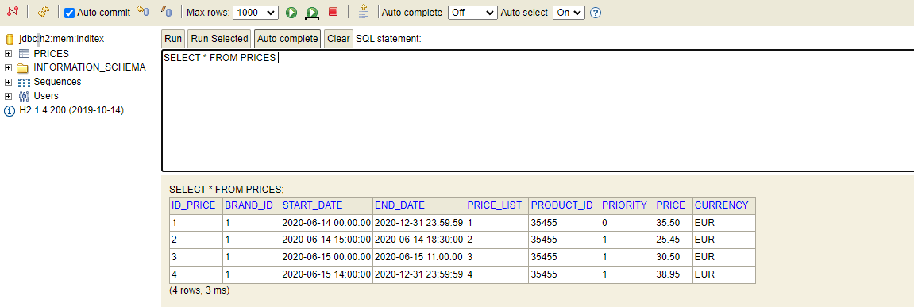
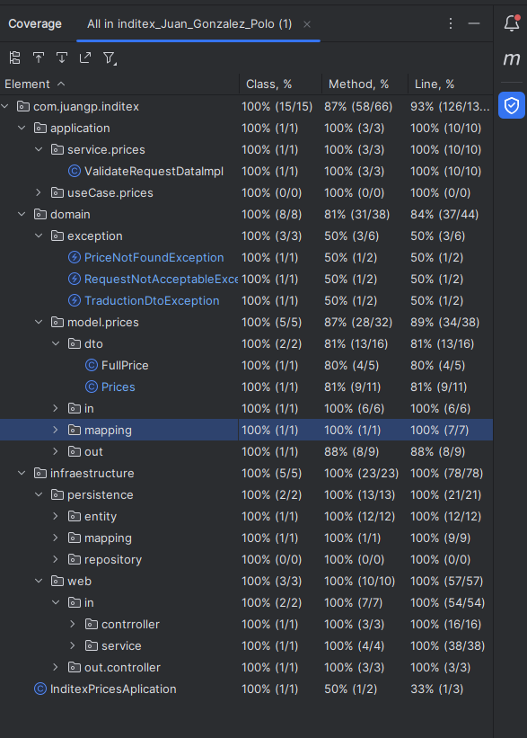

<h1 align=center id="title">Juan González Polo, Inditex Application</h1>


## Project description
The following sample project consist in a Spring Boot application 
that provides a REST service oriented to the finding of different prices
based on the brand, product, and time period consulted. 
It implements an Hexagonal Architecture, to focus on clear separation of 
concerns and independence of business logic from technical implementation 
details, trying to use SOLID-like* approach.

The diagram of the application is shown below.


## Database Description
The application uses an in-memory H2 database, whose structure is as it follows:
##### NOTE: 
This approach considered optimal to add a new field ID. The basic columns on the 
description where enough for this particular case, but this ID makes it 
for easier scalability and the posibility of adding more tables that 
have some sort of correlation with this one. 

### PRICES


### Fields:

- *brand_id*: Brand identifier in the Inditex conglomerate
  (for example, 1 = PULL&BEAR, 2= ZARA...).
- *start_date*, end_date: Range of dates for which the price applies.
- *price_list*: Identifier of the price rate.
- *product_id*: Product identifier.
- *priority*: Tie-breaker. If a product has 2 different prices in the
same period of time, the one with the highest priority is the price applied.
- *price*: Product's vale in ammount of money 
- *currency*: Currency of the price

## REST Endpoints
This application provides 2 endpoints. Both end-up doing the same query and 
fetching/delievering the same data. One of them is type POST, and it requires 
a Request body that will contain the data needed to fulfil the search. The 
other one, is type GET, and it will take the data from the URL as path variables
except for the date, that will be taken as a parameter.

### ENDPOINTS:
```http request
POST /api/v2/prices

GET /api/v2/prices/inditex/brand/{brandId}/product/{productId}?date=YYYY-mm-ddThh:mm:ss
```
### POSTMAN COLLECTION TO TEST IT

This collection includes the 5 test requested
- Test 1: Request at 10:00 on the 14th for product 35455 for brand 1 (ZARA).
- Test 2: Request at 16:00 on the 14th for product 35455 for brand 1 (ZARA).
- Test 3: Request at 21:00 on the 14th for product 35455 for brand 1 (ZARA).
- Test 4: Request at 10:00 on the 15th for product 35455 for brand 1 (ZARA).
- Test 5: Request at 21:00 on the 16th for product 35455 for brand 1 (ZARA).

### Input Parameters
#### POST REQUEST BODY:
```json
{
    "brand": 1,
    "product": 35455,
    "date": "2020-06-14T10:00:00"
}
```
- **brand**: Brand identifier.
- **product**: Product identifier.
- **date**: Date for when you want to know the price.

## Tests
The testing of the application was done using both junit and mockito for integrated tests
to get the most coverage possible. Also, the tool Diffblue as an assitant to
the creation of the tools has proven to be an excellent allie for developing use cases.
Here are the test coverages:


### Intellij Test Coverage Report


### Spring Boot 
At this point, ther's no doubt that Springboot is a popular framework for
Java, specially for building REST applications and microservices.
- Allows rapid development
- Automatic dependency management
- Microservices
- Large ecosystem
- Loads of documentation and community support
- Powerful auto-configuration
- Embedded Servers

### H2 Database
H2 proves to be an easy, well-rounded and quick way to build a small application
like:
- Lightweight and embedded
- Fast and efficient
- In-Memory mode
- Easy setup and configuration
- Compatible with SQL
- Built-in console
- Open source
- Versatile

### Diffblue Cover
analyzes the codebase of a Java application and generates unit tests that 
verify the behavior of methods and classes. These generated tests aim 
to achieve high code coverage and help developers identify potential 
bugs and regressions in their code. 
Although still in development, and unable to create fully working/complete tests,
it proves to be an impactful tool for developing tests.
