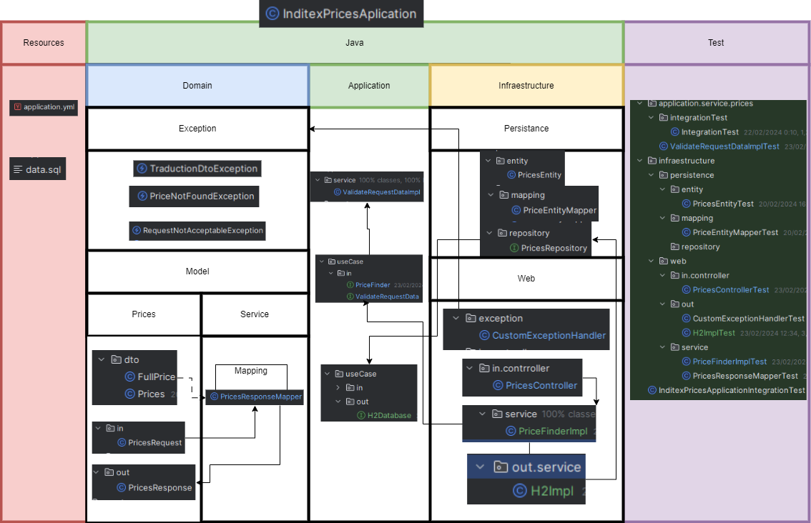
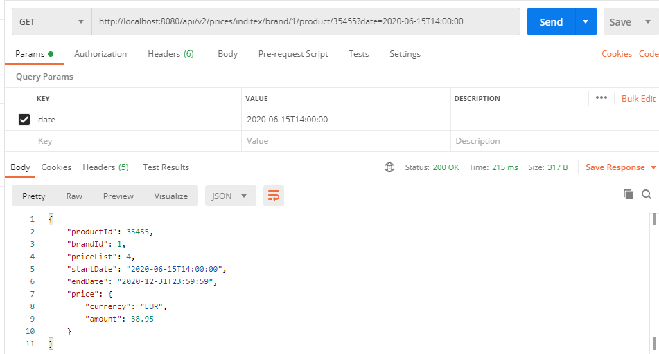
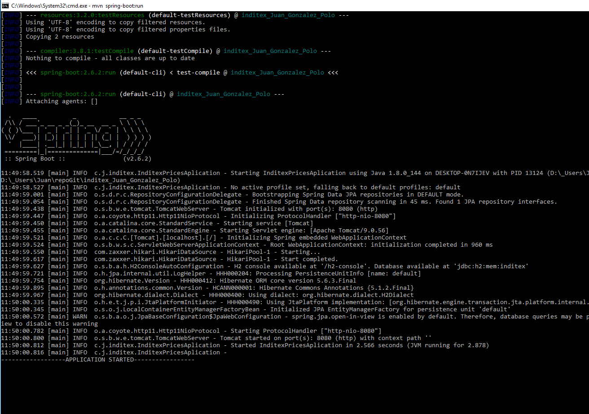
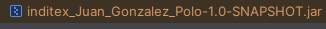

<h1 align=center id="title">Juan González Polo, Inditex Application</h1>


## Project description
The following sample project consist in a Spring Boot application 
that provides a REST service oriented to the finding of different prices
based on the brand, product, and time period consulted. 
It implements a Hexagonal Architecture, to focus on clear separation of 
concerns and independence of business logic from technical implementation 
details, trying to use SOLID-like* approach.

The diagram of the application is shown below. The 3 layers are 
- Application: It defines what the app is going to do
- Domain: Contains the classes that will be used, as well as their 
relations and mappers. It contains custom exceptions as well
- Infrastructure: the logic of the app, and it's enpoints, exception handler,
and external elements needed, such as the H2 Database.



## Database Description
The application uses an in-memory H2 database, whose structure is as it follows:
##### NOTE: 
This approach considered optimal to add a new field ID. The basic columns on the 
description where enough for this particular case, but this ID makes it 
for easier scalability and the posibility of adding more tables that 
have some sort of correlation with this one. 

### PRICES


### Fields:

- *brand_id*: Brand identifier in the Inditex conglomerate
  (for example, 1 = PULL&BEAR, 2= ZARA...).
- *start_date*, end_date: Range of dates for which the price applies.
- *price_list*: Identifier of the price rate.
- *product_id*: Product identifier.
- *priority*: Tie-breaker. If a product has 2 different prices in the
same period of time, the one with the highest priority is the price applied.
- *price*: Product's vale in ammount of money 
- *currency*: Currency of the price

## REST Endpoints
This application provides 2 endpoints. Both end-up doing the same query and 
fetching/delievering the same data. One of them is type POST, and it requires 
a Request body that will contain the data needed to fulfil the search. The 
other one, is type GET, and it will take the data from the URL as path variables
except for the date, that will be taken as a parameter.

##### NOTE:
On the response, the original description didn't include the field "currency",
but I considered it an important data, there's a huge difference between a price in
EUR or in GBP, so I returned a field called "price", containing both the amount and the currency:
```json
{
  "price": {
    "currency": "EUR",
    "amount": 38.95
  }
}
```

### ENDPOINTS:
```http request
POST /api/v2/prices

GET /api/v2/prices/inditex/brand/{brandId}/product/{productId}?date=YYYY-mm-ddThh:mm:ss
```
### POSTMAN COLLECTION TO TEST IT
The collection is ready to import and test (local enviroment):
[Dowload file: POSTMAN COLLECTION FOR TESTING](src/main/resources/documentation/juanGP_inditex.postman_collection.json)


This collection includes the 5 test requested
- Test 1: Request at 10:00 on the 14th for product 35455 for brand 1 (ZARA).
- Test 2: Request at 16:00 on the 14th for product 35455 for brand 1 (ZARA).
- Test 3: Request at 21:00 on the 14th for product 35455 for brand 1 (ZARA).
- Test 4: Request at 10:00 on the 15th for product 35455 for brand 1 (ZARA).
- Test 5: Request at 21:00 on the 16th for product 35455 for brand 1 (ZARA).
### Postman
When executing the calls with Postman, it will look like this:



### Input Parameters
#### POST REQUEST BODY:
```json
{
    "brand": 1,
    "product": 35455,
    "date": "2020-06-14T10:00:00"
}
```
#### GET URL
```http request
GET /api/v2/prices/inditex/brand/1/product/35455?date=2020-06-15T14:00:00
```

- **brand**: Brand identifier.
- **product**: Product identifier.
- **date**: Date for when you want to know the price.
#### RESPONSE BODY
```json
{
  "productId": 35455,
  "brandId": 1,
  "priceList": 4,
  "startDate": "2020-06-15T14:00:00",
  "endDate": "2020-12-31T23:59:59",
  "price": {
    "currency": "EUR",
    "price": 38.95
  }
}
```

## Tests
The testing of the application was done using both junit and mockito for integrated tests
to get the most coverage possible. Also, the tool Diffblue as an assitant to
the creation of the tools has proven to be an excellent allie for developing use cases.
Ther's also a Integration test: *src\test\java\com\juangp\inditex\application\service\prices\integrationTest\IntegrationTest.java*

Here are the test coverages:


### Intellij Test Coverage Report


### Spring Boot 
At this point, ther's no doubt that Springboot is a popular framework for
Java, specially for building REST applications and microservices.
- Allows rapid development
- Automatic dependency management
- Microservices
- Large ecosystem
- Loads of documentation and community support
- Powerful auto-configuration
- Embedded Servers

### H2 Database
H2 proves to be an easy, well-rounded and quick way to build a small application
like:
- Lightweight and embedded
- Fast and efficient
- In-Memory mode
- Easy setup and configuration
- Compatible with SQL
- Built-in console
- Open source
- Versatile

### Diffblue Cover
Analyzes the codebase of a Java application and generates unit tests that 
verify the behavior of methods and classes. These generated tests aim 
to achieve high code coverage and help developers identify potential 
bugs and regressions in their code. 
Although still in development, and unable to create fully working/complete tests,
it proves to be an impactful tool for developing tests. 

### GitHub
For better control over code updates, versions, tags.

### Sonar Lint
This tool for Intellij (and Eclipse or VSC)is a valuable asset to keep in check
the code, as it provides static analysis of the code, whilst is uses the same rules and configurations as SonarQube to grant 
coherence between its real time analysis and the one in a SonarQube server.


# Execution

#### To run the application, use the following command inside the root directory of the project:
##### NOTE
You need to have Maven and a compatible version of Java installed and configured for this to work
```bash
mvn spring-boot:run
```
It will appear like this:

The application will be available at http://localhost:8080
The port is configurated on the application.yml, changeable from there:
server.port = 8080.
The test in the postman collection are already pointing to that direction:

[Dowload file: POSTMAN COLLECTION FOR TESTING](src/main/resources/documentation/juanGP_inditex.postman_collection.json)

#### Compile and test

```bash
mvn clean test
```

#### Building and Packaging
This will build the project and create a JAR in the project *target* directory

```bash
mvn clean install package
```


